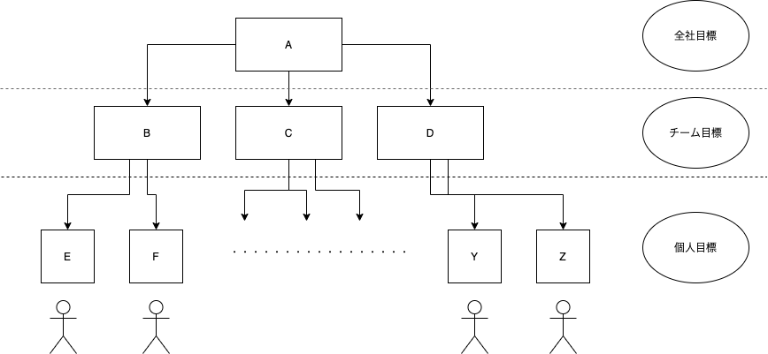

# **OKR**

<!-- Scoped style -->
<style scoped>
h1 {
  font-size: 6rem;
}
p {
  font-size: 50px;
}
</style>

Kohei Misu

---

# OKR とは

会社内のあらゆる組織が
同じ重要な課題に全力で取り組むようにするための経営管理手法

目標(**Objective**)と主要な結果(**Key Results**)の頭文字をとったもの

<!--
要は、みんなで重要なことに対して同じ方向を向いて、クリアしていきましょうというイメージ
一段と高い目標への追求を促します

インテルのCEOを務めたアンディ・グローブが編み出した。

彼は、知識よりも実行を重視していて、知識労働者のアウトプットの定義と測定、またそれを
どう高めていくかという問いに対するアプローチ
-->

---

# なぜ OKR をやるのか

会社内のあらゆる組織が
同じ重要な課題に全力で取り組むようにするための経営管理手法

目標(**Objective**)と主要な結果(**Key Results**)の頭文字をとったもの

<!--
要は、みんなで重要なことに対して同じ方向を向いて、クリアしていきましょうというイメージ
基本的には、大きな目標を分解してチームや個人に落として、期間ごとに進捗を図っていきます
こんな感じです。

インテルのCEOを務めたアンディ・グローブが編み出した。

彼は、知識よりも実行を重視していて、知識労働者のアウトプットの定義と測定、またそれを
どう高めていくかという問いに対するアプローチ
-->

---

# Example



<!--

ある期間で絶対に達成したい大きな目標Aに対して、チームでやることを明らかにし
個人に落としています

この図だけだとトップダウンに見えてしまうが、
現場の声も反映しつつ目標を決めるのがよい。

階層が増えてしまうとトップレベルの目標と現場の意見が乖離してしまう
ティール組織の場合はせめて3階層だからそこまでズレはないように思っている
-->

---
# Why OKR

- 困難な目標に向かうことでパフォーマンスが上がる
<br>
- 社員の定着と熱意の醸成
  - 自社優位性の確立の次に重要とされている
<br>
- 自社の状況がわかる
  - 何を達成しているか、していないのかがわかるため


<!--

<パフォーマンス>
具体性があるとさらに曖昧なものよりアウトプットの水準が高くなる

<社員の定着>
そもそも目標に向かって取り組み、達成していくことは仕事に対する満足度につながります。

<自社の状況がわかる>
OKR の目標はBFのようにオープンに管理されるのですが、組織の団結・明確さにつながります
振り返ることで、何ができているか・できていないかがわかります。

-->

---

# 目標 - Objective

達成すべきものであり、以下の要素を含む

- 重要
- 具体的
- 行動を促す
- (人々を鼓舞する)

<!--
これが定まっていると曖昧な思考
曖昧な業務執行を防ぐワクチンとなる
-->

---

# 主要な結果 - Key Results

目標をどのように達成しつつあるかモニタリングする基準
→ KR がすべて達成されれば、目標は必ず達成されている

有効なKRは以下の要素を含む

- 時間軸がはっきりしている
- 意欲的かつ現実的
- **測定可能で検証可能**
  - 数字が含まれていることが望ましい

<!--
KR が達成されているのに目標が達成されないのであれば設定が間違っている
-->

---

### 数値目標と品質目標が対になっていると望ましい

**ビジネスの場合**

| 数値目標          | 品質目標             | 結果                                                           |
| ----------------- | -------------------- | -------------------------------------------------------------- |
| 四半期のMRR2000万 | 四半期の解約MRR200万 | 適切な顧客へ製品を売る<br>既存顧客へのフォローを行うようになる |

<!--

数値を追わせるだけでは、間違った目標達成になることがあるので
品質目標と組み合わせるとよりよい
目標を王道で正しく達成できるようになる

-->

---

### 数値目標と品質目標が対になっていると望ましい

**プロダクトの場合**

| 数値目標            | 品質目標                         | 結果                                                                       |
| ------------------- | -------------------------------- | -------------------------------------------------------------------------- |
| 新機能を2つリリース | コードカバレッジを1%も落とさない | 開発者が単体テストを書くようになる<br>結合試験時に不具合を起こしにくくなる |

<!--

数値を追わせるだけでは、間違った目標達成になることがあるので
品質目標と組み合わせるとよりよい
目標を王道で正しく達成できるようになる

-->

---

# Example

### 目標

**国内シェアをさらに伸ばすためのチームづくりを継続する**

### 主要な結果

- 技術者を5人採用する
- 営業リーダーを採用する
- すべての面接を受けた人からネガティブなフィードバックがないようにする

<!--

例えば、全社的な採用だとこんな目標を立てられるからもしれません
具体的かつ、数字が盛り込まれており、進捗が容易に追えると思います
そして、3つめの目標で面接の品質を高めるような動きをさせるようになっています
面接の数は大事ですが、数が増えることによって候補者への対応が雑にならないようにすることを防いでいます

-->

---

# Example(四半期後振り返り)

### 目標

**国内シェアをさらに伸ばすためのチームづくりを継続する**

### 主要な結果

- 技術者を5人採用する(0.6) → 3人採用
- 営業リーダーを雇う(1.0) → 採用できた
- すべての面接を受けた人からネガティブなフィードバックがないようにする(0.8)
→ 2割の候補者にネガティブな印象を与えてしまった

---

# 採点について

- 0.7 ~ 1.0 = 青 (完了)
- 0.4 ~ 0.6 = 黄 (進捗はあったが完了できなかった)
- 0.0 ~ 0.3 = 赤 (実のある進捗はなかった)

<!--
Google の例
点数が低いものに関しては、再評価を行い
引き続き取り組む価値があるのか、そうだとすれば達成するために何を変えるべきか検討する

0.7 で完了としているのは、ストレッチ目標を設定させるため

ただし、会社がコミットした事業上の目標は1.0以外はすべて失敗とされる
-->

---

# OKR のカテゴリ

Google では以下2つのカテゴリに分けている

- コミット目標
  - 設定された期限内に達成しなければならないもの
    - 販売額・収益
    - プロダクトリリース
- ストレッチ目標
  - 組織全体を動員するような達成が困難なもの(平均4割が失敗に終わる)
    - マーケットシェアを80%獲得する

<!--
両カテゴリをどのように調整するかは、会社が置かれたフェーズにもよる
これからの四半期、あるいは1年で、会社として、チームとしてどうあるべきか自問しなければならない
既存の地位を確保するのか、新たな市場をこじあけるのか

例えば、google では10倍主義というのがあり、Gmailがその例
-->

---

# コミット目標の運用

- チームには期限までに1.0の成果を達成するために他の優先事項を調整する
- 達成できそうにないチームは速やかに報告し、対策を検討する
- 期日までに1.0に満たない場合は**必ず**事後分析をする

<!--

必ず達成しないとイケないのがポイント

-->

---

# ストレッチ目標の運用

- OKR の優先順位を参考に残された時間を当てる
- 進捗がないからといって削除せず、完了するまではリストに残しておく
- その目標自体があとどのくらいのリソースが必要か把握しておく
  - 必要であれば、リソースを要求する

<!--
-->

---

# ストレッチ目標

Gmail の例

- 顧客に大容量ストレージを利用可能にする
  - 競合が 2 ~ 4MB に対し **1GB**

当初は 100MB の目標だったが
500 倍以上の水準を提供することでカテゴリの常識を一変させた

<!--

このような目標は、技術基盤を一新させるようなことがある
コードベースの刷新や、高トラフィックに耐えうるようなインフラの刷新など

youtube では　一日10億時間の視聴時間を達成するために会社全体のインフラを見直した

-->

---

# Example


<!--
-->

---

# cppy

<!--
-->

---

# cppy

<!--
-->

---

# OKR ってなに

Split pages by horizontal ruler (`---`). It's very simple! :satisfied:

```markdown
# Slide 1

foobar

---

# Slide 2

foobar
```
